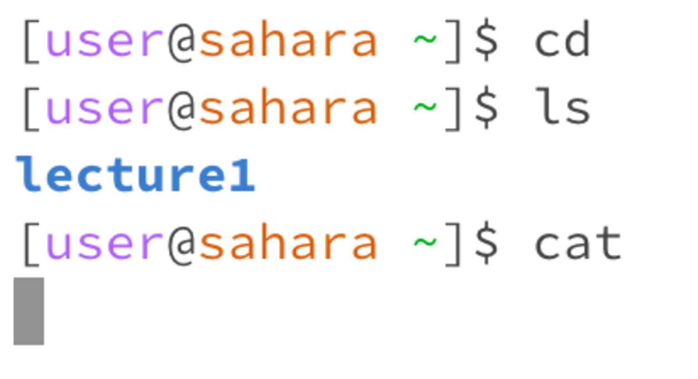
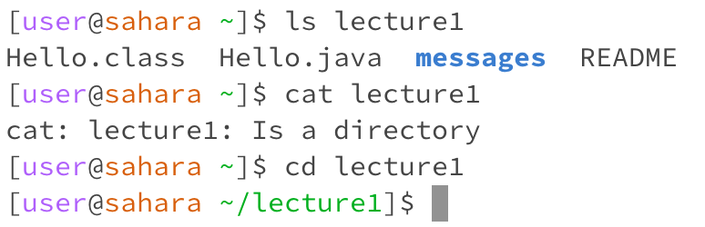
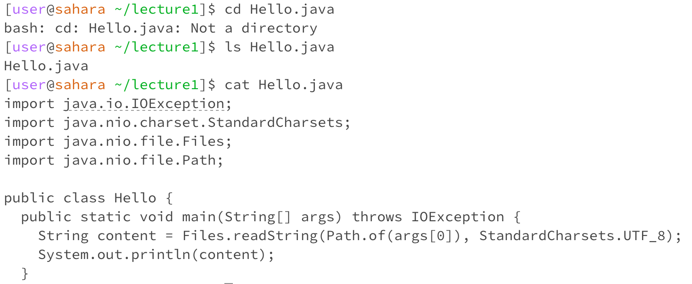

# Lab Report 1

1. 

The working directory of these commands is `/home`.
For the `cd` command, having no arguments changes the working directory to the home directory. This is not an error.
For the `ls` command, having no arguments prompts the listing of files in the current working directory. This also is not an error.
For the `cat` command, having no arguments causes the terminal to continue asking for arguments in a loop. This causes an error since the `cat` command will cause the terminal to not be able to exit the code. The user has to use `Control-C` to exit the processs. 

2.

The working directory of these commands is `/home`.
For the `ls` command, having the directory `lecture1` as the argument prompts the listing of listing of files and folders in `lecture1`. This is not an error.
For the `cat` command, having the directory `lecture1` as the argument causes the terminal to print that `lecture1` is a directory. This is an error since the `cat` command prints files, not directories.
For the `cd` command, directory `lecture1` as the argument changes the working directory from `home` to `lecture1`.

3. 

The working directory of these commands is `/home/lecture1`.
For the `cd` command, having the file `Hello.java` as the argument prints that `Hello.java` is not a directory. This is an error since the argument for `cd` needs to be a directory to be able to process the change.
For the `ls` command, having the file `Hello.java` as the argument prompts the listing of file of `Hello.java`. This is not an error.
For the `cat` command, having the file `Hello.java` as the argument prints out the contents of `Hello.java`. This is not an error.
