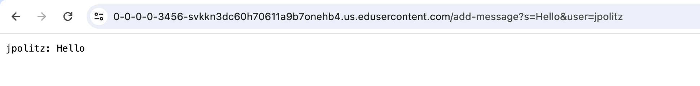
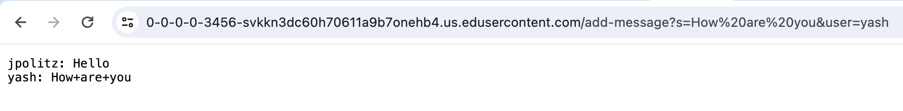
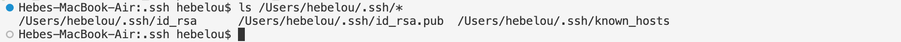
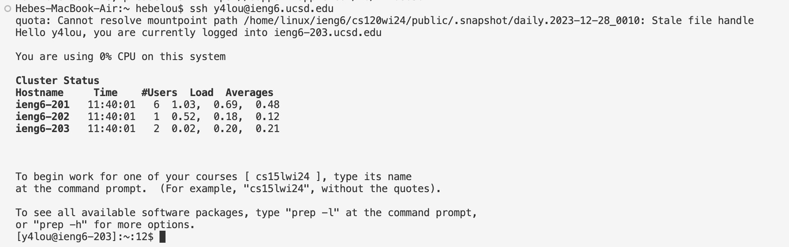

# Lab Report 2
1. 
```
import java.io.IOException;
import java.net.URI;

class ChatHandler implements URLHandler{
  String chatHistory = "";
  public String handleRequest(URI url){
    String query = url.getQuery();
    if(url.getPath().equals("/add-message")){
      if(query.startsWith("s=")){
        String[] parameters = url.getQuery().split("&");
        String message = parameters[0].split("=")[1];
        String user = parameters[1].split("=")[1];
        this.chatHistory += user + ": " + message + "\n";
        return this.chatHistory;
      }else{
        return "Error";
      }
    }else{
      return this.chatHistory;
    }
  }
}

class ChatServer {
  public static void main(String[] args) throws IOException {
    if(args.length == 0){
      System.out.println("Missing port number! For the port number, try any number between 1024 to 49151.");
      return;
    }
    int port = Integer.parseInt(args[0]);
    Server.start(port, new ChatHandler());
  }
}
```

The main method and handleRequest method are called. The relevant arguments are `url` and `/add-message`. The relevant values are that `user` = `jpolitz`, `message`  = `Hello`, `chatHistory`, and `url`. Since each of the strings were just created, the values were changed from null to the relevant values that were entered.


The main method and handleRequest method are called. The relevant arguments are `url` and `/add-message`. The revelant values are that `user` = `yash`, `message` = `How+are+you`, `chatHistory`, and `url`. Since each of these relevant values were updated after the first entry, `user` changes from `jpolitz` to `yash`, `message` changes from `Hello` to `How+are+you`, the new message is added to `chatHistory`, and a new value for `url` is generated.  


2.  

Using VSCode on my computer, the first file is the absolute path to my private key, the second file is the absolute file to my public key ending in `.pub`.


Using VSCode on my computer, this is an instance of logging into my `ieng6` account without having to enter my password. 


3.  
These two weeks I learned how to `ssh` into my remote CSE15L account using the terminal, whether it is in a EdStem workspace or VSCode. I also learned how to set up a server, and that I am able to go and change values of a remote webpage.
