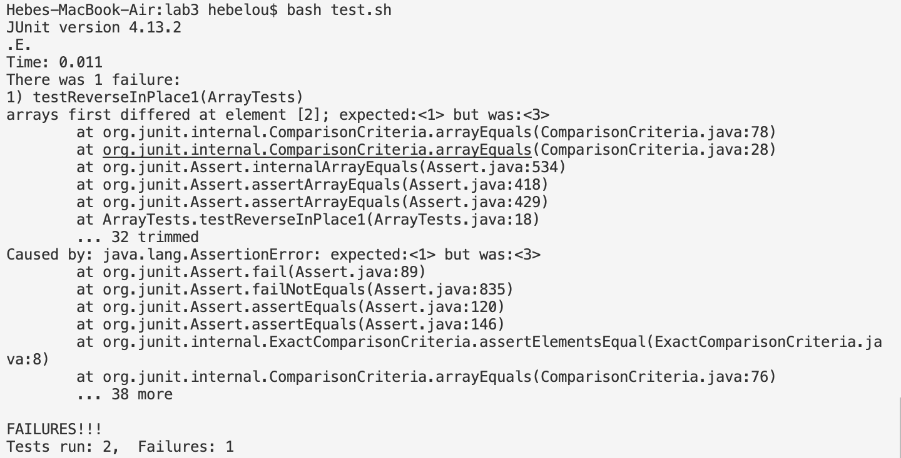

# Lab Report 3
## Part 1
This is the original code for the method `reverseInPlace`.
```
static void reverseInPlace(int[] arr) {
    for(int i = 0; i < arr.length; i += 1) {
      arr[i] = arr[arr.length - i - 1];
    }
  }
```
Below is the JUnit test for a failure inducing input.
```
@Test
  public void testReverseInPlace1(){
    int[] input1 = {1,2,3};
    ArrayExamples.reverseInPlace(input1);
    assertArrayEquals(new int[]{3,2,1}, input1);
  }
```
Below is the JUnit test for an input that doesn't produce a failure.
```
@Test 
	public void testReverseInPlaceSingle() {
    int[] input1 = {3};
    ArrayExamples.reverseInPlace(input1);
    assertArrayEquals(new int[]{3}, input1);
	}
```
Here is the output of running the two tests mentioned.



Here is the fixed code that addresses the bug.
```
static void reverseInPlace(int[] arr) {
    int previous  = arr[0];
    for(int i = 0; i < arr.length/2; i += 1) {
      arr[i] = arr[arr.length - 1 -i];
      arr[arr.length -1 -i] = previous;
      previous = arr[i+1];
    }
  }
```
The original code just replaces the first half of the array with the latter half of the array, essentially reflecting it since the replaced number is not saved. This fixed code addresses that issue by creating another variable to store the replaced number and uses that to do the switch. It also halves the amount of times the switch is done so that a properly reversed array isn't reversed back into its original array.  

## Part 2
The find command recursively searches for files and directories within a specified directory.

The command
```
find ./technical/ -type d
```
Prints out
```
./technical/
./technical//government
./technical//government/About_LSC
./technical//government/Env_Prot_Agen
./technical//government/Alcohol_Problems
./technical//government/Gen_Account_Office
./technical//government/Post_Rate_Comm
./technical//government/Media
./technical//plos
./technical//biomed
./technical//911report
```
This prints out the directories under `./technical/`, aiding the understanding on the directory.

The command
```
find ./technical/ -name "*-PDF.txt"
```
Prints out
```
./technical//government/Alcohol_Problems/Session2-PDF.txt
./technical//government/Alcohol_Problems/Session3-PDF.txt
./technical//government/Alcohol_Problems/DraftRecom-PDF.txt
./technical//government/Alcohol_Problems/Session4-PDF.txt
```
This prints out the files with the extension `.txt` and has `-PDF` in their file name. This can help filter out certain wanted files from all the other files. 

The command 
```
find ./technical/ -size 100
```
Prints out
```
./technical//biomed/1471-2377-3-4.txt
./technical//biomed/gb-2003-4-6-r39.txt
./technical//biomed/gb-2003-4-3-r20.txt
```


The command 
```
find ./technical/ -maxdepth 1
```
Prints out
```
./technical/
./technical//government
./technical//plos
./technical//biomed
./technical//911report
```
