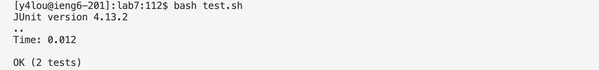

# Lab Report 4
1.  Keys pressed: `ssh y4lou@ieng6.ucsd.edu <enter>`. I used this command to `ssh` into my `ieng6` account and pressed `<enter>` to run the command.
2.  Keys pressed: `git clone <command+V> <enter>`. I used `<command+V>` to paste the `ssh` URL to clone the repository and pressed `<enter>` to run the command. 
3.  Keys pressed: `bash test.sh <enter>`. I used `bash` to run the test and pressed `<enter>` to run the command. 
4.   Keys pressed: `vim L <tab> .j <tab> <enter> 43j e i <right> <delete> 2 <esc> :wq`. I used vim to edit the file, and used `<tab>` to auto-complete the `ListExamples.java` file so that I don't have to type as much. I then used `<enter>` to run the command, and typed `43j e` to skip to the line 43 that needed the change and `e` to the end of the word `index1`. I then pressed `i` to enter insert mode, `<right> <delete> 2` to go right and replace 1 with 2, `<esc>` to get out of insert mode and `:wq` to save and quit vim. 
5.  Keys pressed: `<up> <up> <enter>`. I pressed `<up>` two times to go up two commands to get `bash test.sh` from the command history, and pressed `<enter>` to run the command. 
6.  Keys pressed: `git add L <tab> <enter> git commit <enter> G i <right> <delete> Fixed index error <esc> :wq git push <enter>`. I ran the command to add the edit, and used `<tab>` to auto-complete the file and `<enter>` to run the command. Then I committed the edit using `<enter>` to run the command, and pressed `<G>` to go to the end of the commit message, `<i>` to enter insert mode, `<right> <enter>` to create a new line for the message, typed out my message, and then used `<esc>`  to exit insert mode. I pushed the edit to github and used `<enter>` to run the command. 
