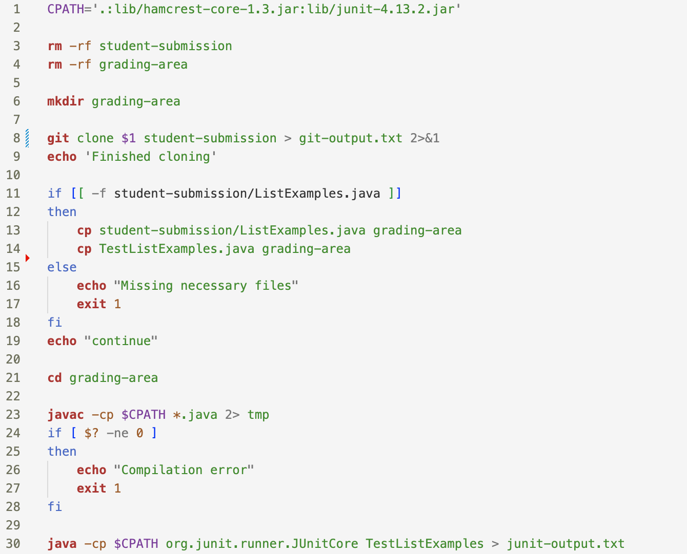
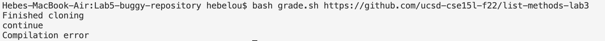
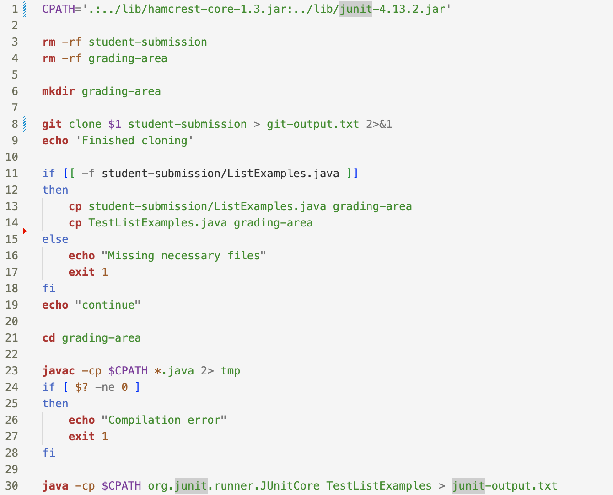
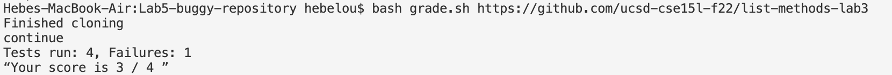

# Lab Report 5
## Part 1

Question: When I try to compile the lab3 repository to test if my autograder works, it doesn't compile even though it should. This is what I entered, and my code for grade.sh. What is the problem here? 

Answer: Think about where your working directory is in when the javac command is ran. Try using pwd in grade.sh and in your terminal. How does that compare to CPATH and what can you add to CPATH for the command to run successfully? 

Using the advice above, the bug in grade.sh can be fixed. The bug is that the `grading-area` directory does not have the `lib` directory to run the tests, so `..` needs to be added in CPATH since `lib` is in the home directory.

