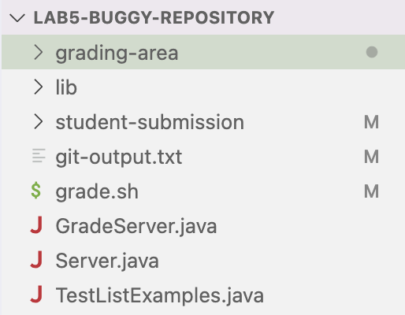

# Lab Report 5
## Part 1

Question: When I try to compile the `lab3` repository to test if my autograder works, it doesn't compile even though it should. This is what my terminal looks like, and my code for `grade.sh`. What is the problem here? 

Answer: Think about where your working directory is in when the javac command is ran. How does that compare to `CPATH` and what can you add to `CPATH` for the command to run successfully? 

Using the advice above, the bug in `grade.sh` can be fixed. The bug is that the `grading-area` directory does not have the `lib` directory to run the tests, so `..` needs to be added in `CPATH` since `lib` is in the home directory.

The file and directory structure is as follows:  
  
The file contents before fixing the bug, full command line ran, and description are as shown and explained above.

## Part 2
In the second half of this quarter, I learned how to create my own autograder using bash scripts. I also learned how to edit files from the command line and how to only use the terminal to push the edit to my own repository. Adding on, I understood how to use jdb to debug code. 
